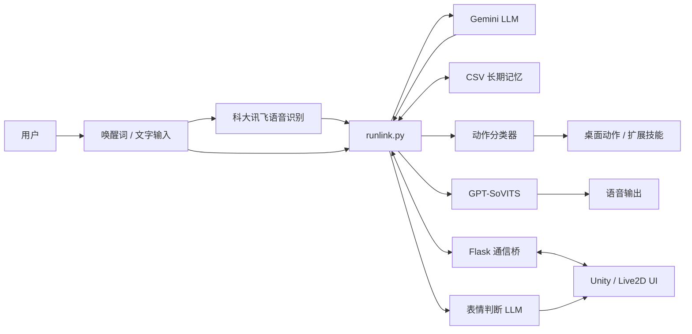

# TianBaiAI Core — Alpha

> **天白AI — 可扩展多功能多模态交互智能助手**  
> 一个面向 Windows 的实验性多模态桌面 AI 助手核心，将 LLM 推理、语音交互、长期记忆、桌面操作以及可选的 Unity / Live2D 界面连接在一起。


## 项目简介

**TianBaiAI Core（天白AI）** 是一个个人 AI 助手实验项目。它基于一个很简单的想法：LLM 不应该只负责“回复消息”，还应该能够真正地 **听见、记住、说话、表达情绪，并与桌面环境发生交互**。

项目的主运行入口 `runlink.py` 负责协调多个相互独立的子系统：

- **Gemini 驱动的对话与推理**，并要求模型返回结构化 JSON。
- 使用 **Picovoice Porcupine** 实现唤醒词检测。
- 使用 **科大讯飞 RTASR** 实现实时语音识别。
- 通过本地 **GPT-SoVITS API** 进行语音合成。
- 使用本地 CSV 文件构建带关键词别名的 **长期记忆系统**。
- 将自然语言意图映射到本地程序和扩展脚本的 **桌面动作系统**。
- 通过轻量级本地 Flask 服务实现 **Python 与 Unity / Live2D UI 通信**。
- 使用额外的 LLM 请求完成 **情绪 / 表情映射**。

当前仓库仍处于 **Alpha 阶段**，它首先是一个个人实验性原型，而不是开箱即用的生产级 AI 助手。部分集成、软件路径和桌面动作仍针对原开发环境进行了定制，在其他电脑上运行前需要重新配置。

## 功能特性

### LLM 对话核心

`llmapi.py` 使用 Google GenAI SDK，目前调用 `gemini-2.0-flash`。

主提示词要求模型返回结构化数据，其中可以包含：

- 对话内容
- 情绪
- 动作 / 表现
- 好感度
- 记忆读取请求
- 记忆写入请求
- 桌面操作指令

近期对话记录会保存到本地 `history.json`，并根据配置中的历史长度自动截断。

### 语音交互

TianBaiAI 可以作为一个以语音交互为主的桌面助手运行，其主要流程如下：

1. Picovoice Porcupine 持续监听自定义唤醒词。
2. 唤醒后，由科大讯飞 RTASR 获取麦克风音频并进行实时语音识别。
3. 识别出的文字发送给 LLM。
4. LLM 返回结构化回复。
5. GPT-SoVITS 根据回复文字和情绪生成语音。
6. 音频可以直接在本机播放，也可以交由 UI 层播放。

语音输入、唤醒词检测和语音合成都可以独立开启或关闭。

### 长期记忆

`memory/IOmemory.py` 实现了一个简单的长期记忆系统，将需要保留的信息存储到 CSV 文件中，而不是全部塞进有限的短期对话上下文。

当前支持：

- 带时间戳的记忆条目
- 按类别保存记忆
- 同一记忆类别的多个关键词 / 别名
- 由 LLM 主动触发记忆读取
- 由 LLM 主动触发记忆写入

运行时生成的个人记忆文件已经加入 `.gitignore`，默认不会被提交到 Git 仓库。

### 桌面动作与技能系统

TianBaiAI 可以将 LLM 生成的自然语言操作转换成本地桌面行为。

当前动作处理流程大致为：

```text
LLM 生成动作
   ↓
classification_rules.json
   ↓
classcut.py
   ↓
action.json
   ↓
actions.py
   ↓
打开本地程序 / 执行扩展脚本
```

目前仓库中已有的动作示例包括：

- 打开浏览器和指定网址
- 打开 VS Code、文件管理器、计算器等程序
- 打开 QQ、微信、Minecraft 等本地应用
- 控制网易云音乐
- 打开 Windows 天气
- 操作 Windows 时钟并创建闹钟
- 打开项目设置

动作注册机制保持得比较简单，方便快速实验。可以通过新增分类规则、动作定义以及 `extra/` 下的扩展脚本来加入新的能力。

> **注意：** `actions/action.json` 中目前包含多处与原开发机器绑定的 Windows 绝对路径。启用桌面动作之前，请先将这些路径修改为你自己的本地路径。

### Unity / Live2D 通信

`webapi.py` 会在本地启动一个 Flask 服务：

```text
127.0.0.1:4070
```

它作为 Python 核心与外部 Unity UI 之间的轻量级消息桥梁。

当前接口：

```text
POST /upmassage
GET  /inmassage
```

运行时可以通过该通道传递：

- 对话消息
- 状态提示
- 音频播放请求
- 输入控制
- Live2D 表情切换指令

因此，TianBaiAI Core 可以作为后端逻辑，而 Unity / Live2D 负责角色显示和交互界面。

### 情绪与表情映射

`expressionllmapi.py` 使用 `expressionprompt.txt` 进行额外一次 Gemini 请求，根据助手当前回复判断对应的表情 ID。

当 Unity UI 功能开启后，该 ID 可以通过本地通信接口发送给 Live2D 表情控制器，从而让角色的视觉表现与回复情绪联动。

## 系统架构



## 项目结构

```text
TianBaiAI-core-Alpha/
├── runlink.py                  # 主运行入口 / 系统协调器
├── llmapi.py                   # Gemini 对话接口
├── expressionllmapi.py         # 表情判断 LLM 接口
├── system_prompt.txt           # 主角色提示词与输出格式定义
├── expressionprompt.txt        # 表情判断提示词
├── creat.py                    # 首次运行配置与记忆初始化
├── config_init.json            # UI / 设置项配置元数据
├── webapi.py                   # Python ↔ Unity Flask 通信桥
├── rtasr_python3_demo.py       # 科大讯飞实时语音识别
├── tovitsapi.py                # GPT-SoVITS 语音生成与播放
├── actions/
│   ├── action.json             # 动作注册表
│   ├── classification_rules.json
│   ├── classcut.py             # 基于规则的动作分类器
│   └── actions.py              # 动作执行器
├── memory/
│   └── IOmemory.py             # CSV 长期记忆系统
├── wake_up/
│   ├── runwake.py              # Porcupine 唤醒词运行模块
│   └── model/                  # 唤醒词与模型资源
├── extra/
│   ├── browser/                # 浏览器 / URL 技能
│   ├── clock/                  # Windows 闹钟自动化
│   ├── music163/               # 网易云音乐自动化
│   ├── setting/                # 设置扩展
│   └── weather/                # Windows 天气启动器
├── BeginAudio/                 # 唤醒 / 提示音资源
├── AudioTemp/                  # 生成语音临时目录
├── run.bat                     # 单次启动脚本
├── fulltime_start.bat          # 退出或崩溃后自动重新启动
└── LICENSE                     # Apache License 2.0
```

## 运行环境

当前实现主要面向 **Windows**。

推荐环境：

- Python 3.10+
- Windows 10 / 11
- 麦克风和音频输出设备
- `PATH` 中可使用 FFmpeg / `ffprobe`
- Google Gemini API Key
- 开启语音输入时需要科大讯飞 RTASR App ID 与 API Key
- 开启唤醒词时需要 Picovoice AccessKey
- 开启语音合成时需要一个正在运行的 GPT-SoVITS HTTP API
- 如需图形角色界面，可额外连接 Unity 客户端

目前仓库还没有提供锁定版本的 `requirements.txt` 或 `pyproject.toml`。

当前代码使用到的主要 Python 依赖包括：

```bash
pip install google-genai flask keyboard requests sounddevice soundfile pyaudio websocket-client pvporcupine pvrecorder pyautogui pygetwindow pyperclip pywin32 opencv-python
```

根据 Python 和 Windows 版本不同，`PyAudio` 可能需要安装兼容的预编译 wheel，或额外配置本地编译环境。

## 安装与配置

### 1. 克隆仓库

```bash
git clone https://github.com/Ink-bai5844/TianBaiAI-core-Alpha.git
cd TianBaiAI-core-Alpha
```

### 2. 创建 Python 虚拟环境

```powershell
python -m venv .venv
.\.venv\Scripts\Activate.ps1
python -m pip install --upgrade pip
```

然后安装上文列出的依赖。

### 3. 生成并配置 `config.json`

首次运行：

```powershell
python runlink.py
```

如果项目目录中不存在 `config.json`，`creat.py` 会自动生成默认配置文件。

生成后请先编辑该文件，填写自己的 API Key、本地路径和相关服务地址，再进行正常运行。

主要配置项：

| 配置项 | 作用 |
|---|---|
| `Gemini_key` | Google Gemini API Key |
| `history_length` | 保留的近期对话长度 |
| `wake_word` | 是否启用唤醒词 |
| `voice_input` | 是否启用麦克风语音识别 |
| `voice_synthesis` | 是否启用 GPT-SoVITS 语音输出 |
| `save_voice_path` | 生成语音文件的保存路径 |
| `IFLYTEK_appid` | 科大讯飞 RTASR App ID |
| `IFLYTEK_apikey` | 科大讯飞 RTASR API Key |
| `gpt_sovits_url` | GPT-SoVITS HTTP TTS 地址 |
| `wake_access_key` | Picovoice AccessKey |
| `Project_Path` | TianBaiAI 项目本地路径 |

> **Alpha 注意事项：** 当前自动生成的配置中使用了 `UI_enable`，而部分运行代码读取的是 `ui_enable`。这个命名差异后续应统一。在此之前，如果需要切换 UI，请同时检查对应运行代码中的字段名。

### 4. 配置本地桌面动作

打开：

```text
actions/action.json
```

将其中的程序和目录路径修改为你自己电脑上的实际位置。

较复杂的桌面自动化脚本位于：

```text
extra/
```

这些脚本中也可能存在与原开发环境绑定的软件路径，因此建议在启用前逐个检查。

### 5. 配置 GPT-SoVITS 参考音频

`tovitsapi.py` 当前针对不同情绪配置了本地参考音频路径。

如果需要使用带情绪差异的语音合成，请将其中的参考音频文件路径替换为你自己的 GPT-SoVITS 参考音频。

### 6. 启动 TianBaiAI

直接运行：

```powershell
python runlink.py
```

Windows 下也可以使用：

```text
run.bat
```

如果希望程序退出或崩溃后自动重新启动，可以使用：

```text
fulltime_start.bat
```

该脚本会在 Python 主程序结束后等待数秒并重新启动。

## 扩展新的动作技能

目前动作系统的设计比较轻量，因此加入新的能力相对直接。

一个典型的新技能扩展流程为：

1. 在 `actions/classification_rules.json` 中新增或修改匹配规则。
2. 在 `actions/action.json` 中新增动作定义。
3. 将动作指向某个本地程序、文件路径，或者扩展脚本。
4. 对于较复杂的自动化逻辑，在 `extra/<技能名>/` 下创建独立脚本。

这种设计将 **LLM 的自然语言理解 / 推理** 与 **本地确定性操作** 分离开来，便于快速增加新的桌面能力，同时也更容易定位问题。

## 当前限制

本项目保留 **Alpha** 标识是有意为之，目前仍存在一些明显的实验性限制：

- 当前桌面自动化主要针对 Windows。
- 仓库中仍存在部分绝对本地路径。
- 完整语音链路依赖多个外部服务。
- 尚未提供固定版本的 `requirements.txt` 或 `pyproject.toml`。
- 部分配置字段和历史模块仍需要进一步整理。
- 桌面 Action 当前没有沙箱机制，启用的技能可以直接启动本地程序和脚本。
- 当前记忆系统和动作系统属于实验实现，不适合作为经过安全加固的多人服务直接部署。
- Unity UI 使用的是自定义本地通信协议，目前并不是稳定的公共 API。

## 安全与隐私

TianBaiAI 能够访问本地程序，并会在磁盘上保存对话和记忆数据，因此在开启桌面动作能力之前，应先检查代码和本机配置。

- 不要将真实 API Key、Access Token 等凭据提交到 Git。
- `config.json` 已经被加入 `.gitignore`，请继续将它作为本地私有配置文件使用。
- 启用自动 Action 前，请检查 `actions/action.json` 中的每一项操作。
- 对话历史、语音文件和长期记忆都应视为个人隐私数据。
- 如果某个 API Key 曾经被提交进 Git 历史，仅删除最新版代码中的 Key 并不足够，应当直接撤销或轮换该凭据。

## 后续方向

未来可以继续向这些方向演进：

- 增加统一的多 LLM Provider 适配层
- 使用结构化 Tool / Function Calling 替代自由文本 Action 分类
- 为高风险桌面操作加入权限与确认机制
- 将长期记忆升级为向量 / 语义检索系统
- 统一配置字段，并迁移到环境变量或更规范的配置系统
- 增加依赖锁定和可复现安装环境
- 将本地路径与自动化实现抽象为跨平台适配器
- 使用 WebSocket 替代当前轮询式 UI 通信
- 增加自动化测试、日志系统、异常隔离与插件生命周期管理

## 开源协议

本项目使用 **Apache License 2.0** 开源。

详细内容请查看 [`LICENSE`](LICENSE)。

---

**TianBaiAI Core —— 让 AI 不只能够回答问题，也能够拥有声音、记忆、表情，并真正与它所在的桌面世界发生交互。**
