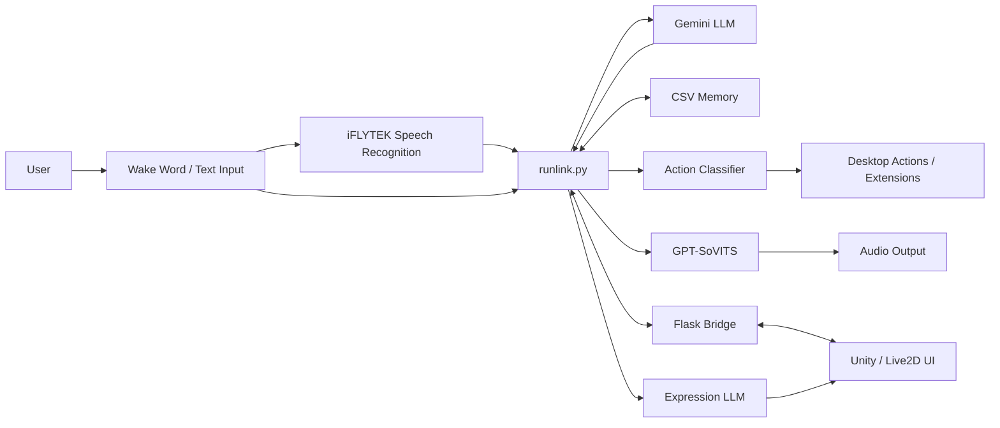

# TianBaiAI Core — Alpha

> **天白AI — 可扩展多功能多模态交互智能助手**  
> An experimental, Windows-first multimodal desktop AI assistant core that connects LLM reasoning with voice interaction, persistent memory, desktop actions, and an optional Unity/Live2D interface.


## Overview

**TianBaiAI Core** is a personal AI assistant experiment built around a simple idea: an LLM should not only answer messages, but also **listen, remember, speak, express emotion, and interact with the desktop**.

The main runtime, `runlink.py`, coordinates several independent subsystems:

- **Gemini-powered dialogue and reasoning** with structured JSON responses.
- **Wake-word detection** through Picovoice Porcupine.
- **Real-time speech recognition** through iFLYTEK RTASR.
- **Speech synthesis** through a local GPT-SoVITS API.
- **Persistent memory** stored in local CSV files with keyword aliases.
- **Desktop action routing** that maps natural-language intentions to local programs and extension scripts.
- **Unity / Live2D communication** through a lightweight local Flask bridge.
- **Emotion / expression selection** using a secondary LLM request.

This repository is an **Alpha-stage personal prototype**, not a plug-and-play production assistant. Several integrations and action paths are currently tailored to the original Windows environment and should be reconfigured before use on another machine.

## Features

### LLM conversation core

`llmapi.py` uses the Google GenAI SDK and currently targets `gemini-2.0-flash`. The assistant is prompted to return structured data containing fields such as:

- response text
- emotion
- movement
- favorability
- memory read/write requests
- desktop actions

Conversation history is persisted locally in `history.json` and trimmed according to the configured history length.

### Voice interaction

TianBaiAI can run as a voice-first assistant:

1. Picovoice Porcupine listens for the custom wake word.
2. iFLYTEK RTASR captures microphone audio and performs real-time speech recognition.
3. The recognized text is sent to the LLM.
4. The response is synthesized by GPT-SoVITS.
5. The generated audio is played locally or forwarded to the UI layer.

Voice input, wake-word detection, and speech synthesis can be enabled or disabled independently.

### Persistent memory

The memory subsystem in `memory/IOmemory.py` stores long-term information in CSV files rather than placing everything in the short conversation window.

It supports:

- timestamped memory entries
- category-based memory fields
- multiple aliases for the same memory key
- explicit LLM-triggered memory reads
- explicit LLM-triggered memory writes

Generated memory files are ignored by Git so personal memory does not need to be committed to the repository.

### Desktop actions and skills

The assistant can turn LLM-generated actions into local desktop operations.

The action pipeline is roughly:

```text
LLM action
   ↓
classification_rules.json
   ↓
classcut.py
   ↓
action.json
   ↓
actions.py
   ↓
Open local application / run extension script
```

Current examples include:

- opening browsers and URLs
- launching VS Code, File Explorer, Calculator, QQ, WeChat, Minecraft, and other local applications
- controlling NetEase Cloud Music
- opening the Windows Weather app
- creating alarms through the Windows Clock app
- opening project settings

The action registry is intentionally simple and can be extended by adding new rules, action definitions, and scripts under `extra/`.

> **Important:** many entries in `actions/action.json` currently contain machine-specific absolute Windows paths. Replace them with paths valid on your own system before enabling desktop actions.

### Unity / Live2D bridge

`webapi.py` exposes a local Flask service on:

```text
127.0.0.1:4070
```

It provides a lightweight message bridge between the Python core and an external Unity UI.

Current endpoints:

```text
POST /upmassage
GET  /inmassage
```

The runtime uses this bridge for dialogue messages, status text, audio playback requests, input controls, and Live2D expression changes.

### Emotion and expression mapping

`expressionllmapi.py` performs a separate Gemini request using `expressionprompt.txt` to map assistant output to an expression ID. When the UI bridge is enabled, that ID can be forwarded to a Live2D expression controller.

## Architecture



## Project structure

```text
TianBaiAI-core-Alpha/
├── runlink.py                  # Main orchestrator / runtime
├── llmapi.py                   # Gemini dialogue interface
├── expressionllmapi.py         # Expression-selection LLM interface
├── system_prompt.txt           # Main assistant persona and output schema
├── expressionprompt.txt        # Expression-selection prompt
├── creat.py                    # First-run config and memory initialization
├── config_init.json            # Configuration metadata for UI/settings
├── webapi.py                   # Python ↔ Unity Flask bridge
├── rtasr_python3_demo.py       # iFLYTEK real-time speech recognition
├── tovitsapi.py                # GPT-SoVITS synthesis and audio playback
├── actions/
│   ├── action.json             # Action registry
│   ├── classification_rules.json
│   ├── classcut.py             # Rule-based action classifier
│   └── actions.py              # Action executor
├── memory/
│   └── IOmemory.py             # Persistent CSV memory subsystem
├── wake_up/
│   ├── runwake.py              # Porcupine wake-word runtime
│   └── model/                  # Wake-word/model resources
├── extra/
│   ├── browser/                # URL/browser actions
│   ├── clock/                  # Windows alarm automation
│   ├── music163/               # NetEase Cloud Music automation
│   ├── setting/                # Settings extension
│   └── weather/                # Windows Weather launcher
├── BeginAudio/                 # Wake/response audio resources
├── AudioTemp/                  # Generated speech output
├── run.bat                     # Start once
├── fulltime_start.bat          # Restart runtime after exit/crash
└── LICENSE                     # Apache License 2.0
```

## Requirements

The current implementation is designed primarily for **Windows**.

Recommended environment:

- Python 3.10+ recommended
- Windows 10/11
- microphone and audio output device
- FFmpeg / `ffprobe` available in `PATH`
- Google Gemini API key
- iFLYTEK RTASR App ID and API key if voice input is enabled
- Picovoice AccessKey if wake-word detection is enabled
- a running GPT-SoVITS HTTP API if speech synthesis is enabled
- optional Unity client for the graphical / Live2D interface

The repository does not currently provide a pinned dependency file. The main Python dependencies used by the current code include:

```bash
pip install google-genai flask keyboard requests sounddevice soundfile pyaudio websocket-client pvporcupine pvrecorder pyautogui pygetwindow pyperclip pywin32 opencv-python
```

Depending on your Python and Windows version, `PyAudio` may require a compatible prebuilt wheel or additional system setup.

## Setup

### 1. Clone the repository

```bash
git clone https://github.com/Ink-bai5844/TianBaiAI-core-Alpha.git
cd TianBaiAI-core-Alpha
```

### 2. Create a virtual environment

```powershell
python -m venv .venv
.\.venv\Scripts\Activate.ps1
python -m pip install --upgrade pip
```

Install the required packages listed above.

### 3. Generate and edit `config.json`

Run the project once:

```powershell
python runlink.py
```

If `config.json` does not exist, `creat.py` creates it automatically. Edit the generated file and provide your own credentials and local paths before normal use.

Important configuration fields include:

| Field | Purpose |
|---|---|
| `Gemini_key` | Google Gemini API key |
| `history_length` | Number of recent conversation turns retained |
| `wake_word` | Enable or disable wake-word detection |
| `voice_input` | Enable or disable microphone speech recognition |
| `voice_synthesis` | Enable or disable GPT-SoVITS output |
| `save_voice_path` | Generated speech file path |
| `IFLYTEK_appid` | iFLYTEK RTASR App ID |
| `IFLYTEK_apikey` | iFLYTEK RTASR API key |
| `gpt_sovits_url` | GPT-SoVITS HTTP TTS endpoint |
| `wake_access_key` | Picovoice AccessKey |
| `Project_Path` | Local project directory |

> Alpha note: the generated config currently uses `UI_enable`, while parts of the runtime read `ui_enable`. This naming should be normalized in a future cleanup. Until then, check the runtime code when changing the UI switch.

### 4. Configure local actions

Open:

```text
actions/action.json
```

Replace application and directory paths with locations valid on your own machine. Extra automation scripts can be found under `extra/`.

### 5. Configure GPT-SoVITS reference audio

`tovitsapi.py` currently contains local reference-audio paths for different emotions. Replace those paths with your own GPT-SoVITS reference audio files if you want emotion-dependent voice synthesis.

### 6. Start TianBaiAI

Directly:

```powershell
python runlink.py
```

Or on Windows:

```text
run.bat
```

For a simple restart loop that relaunches the runtime after it exits or crashes:

```text
fulltime_start.bat
```

## Extending the action system

A simple way to add a new skill is:

1. Add or update matching patterns in `actions/classification_rules.json`.
2. Add an action entry in `actions/action.json`.
3. Point the action to a local executable/path or an extension script.
4. Put more complex automation logic under `extra/<skill-name>/`.

This keeps LLM reasoning separate from deterministic local execution and makes new desktop capabilities relatively easy to prototype.

## Current limitations

This project intentionally carries the **Alpha** label. Important limitations include:

- Windows-specific automation and absolute local paths are still present.
- Several external services are required for the full voice pipeline.
- Dependencies are not yet pinned in a `requirements.txt` or `pyproject.toml`.
- Some configuration names and legacy modules still need cleanup.
- Desktop actions are not sandboxed; enabled skills can launch local programs and scripts.
- The memory and action systems are experimental and are not designed as hardened multi-user services.
- The optional UI protocol is a custom local integration rather than a stable public API.

## Security and privacy

TianBaiAI can access local applications and stores conversation/memory data on disk, so review the code and configuration before running it with desktop actions enabled.

- Never commit real API keys or access tokens.
- Keep `config.json` private; it is already ignored by Git.
- Review `actions/action.json` before enabling automatic actions.
- Treat conversation history, generated audio, and memory files as private user data.
- If a credential has ever been committed to Git history, rotate or revoke it rather than only deleting it from the latest file.

## Roadmap ideas

Potential directions for future versions:

- provider-agnostic LLM adapter layer
- structured tool/function calling instead of free-form action classification
- safer action permissions and confirmation policies
- vector or semantic long-term memory
- normalized configuration and environment variables
- dependency locking and reproducible setup
- platform-independent paths and automation adapters
- WebSocket-based UI transport
- tests, logging, error isolation, and plugin lifecycle management

## License

This project is licensed under the **Apache License 2.0**. See [`LICENSE`](LICENSE) for details.

---

**TianBaiAI Core — giving an AI assistant a voice, memory, expression, and the ability to interact with its desktop world.**
